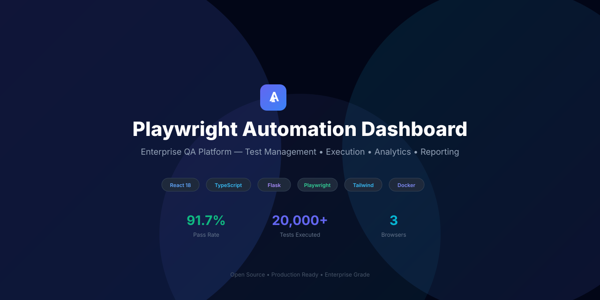
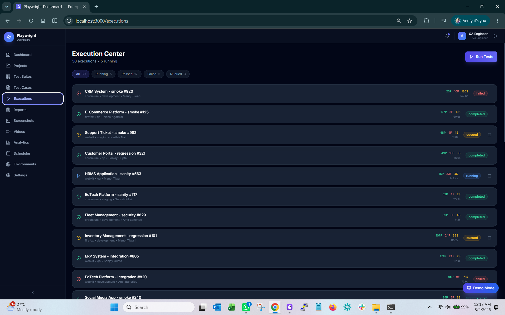
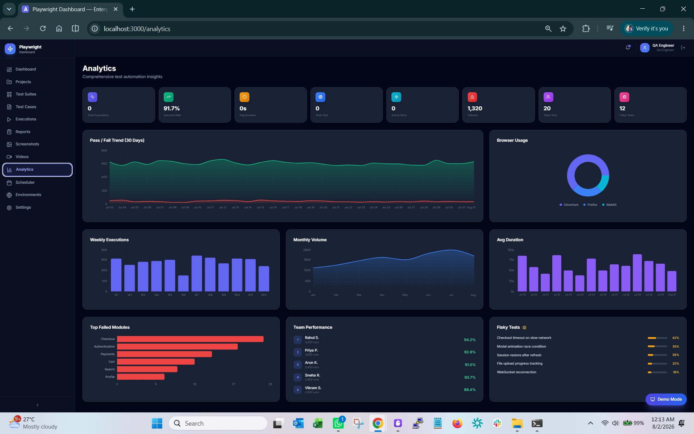
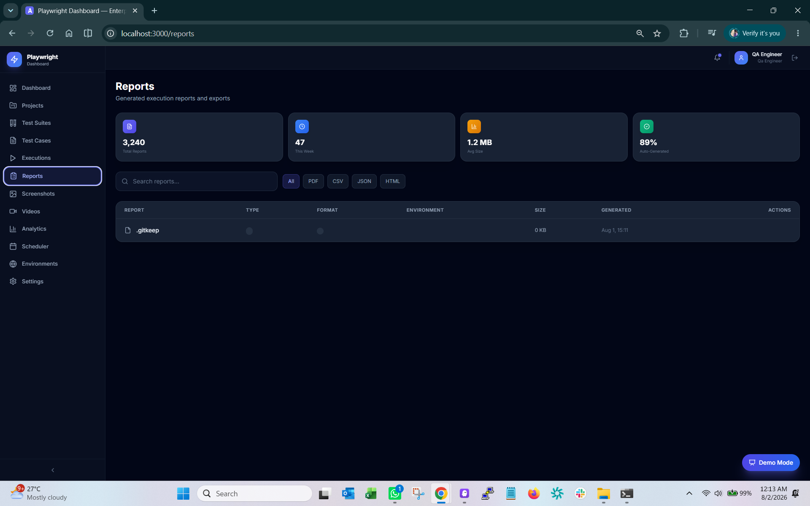
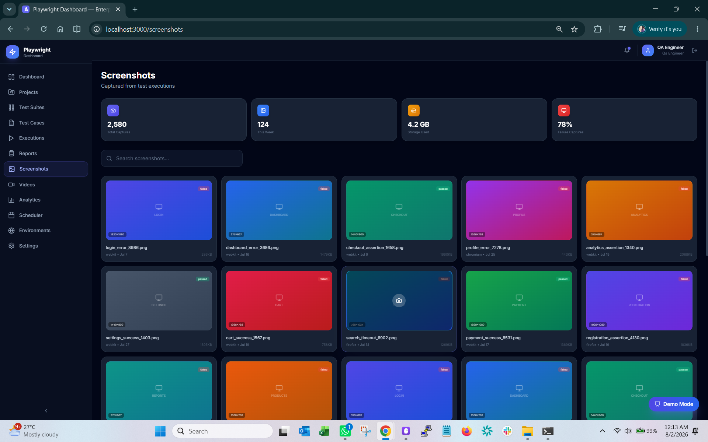
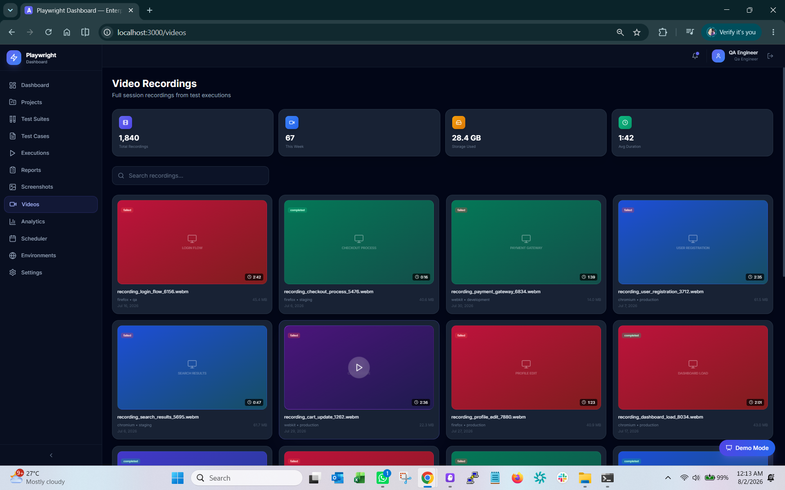
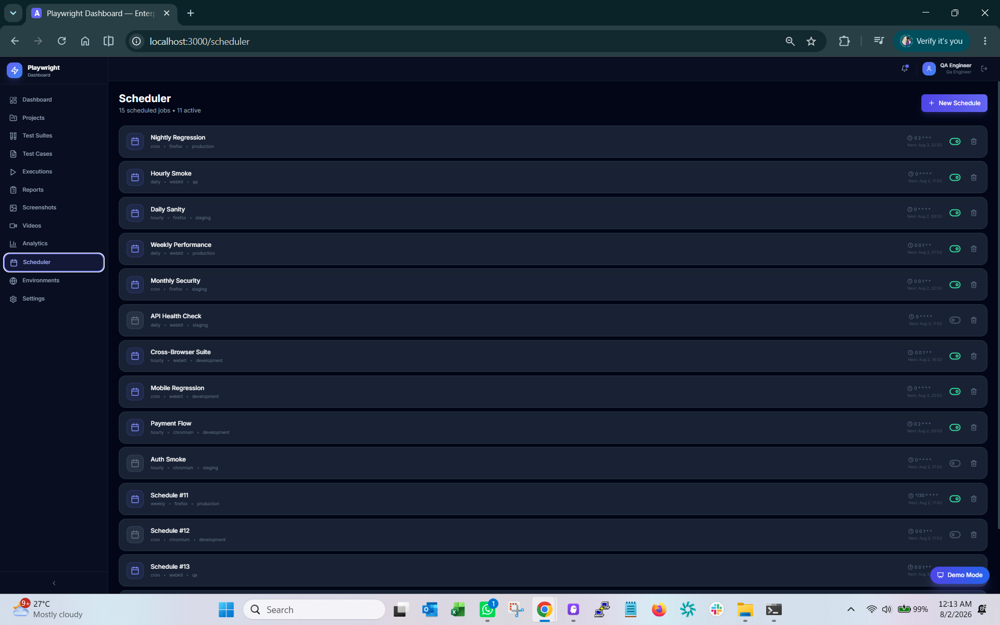
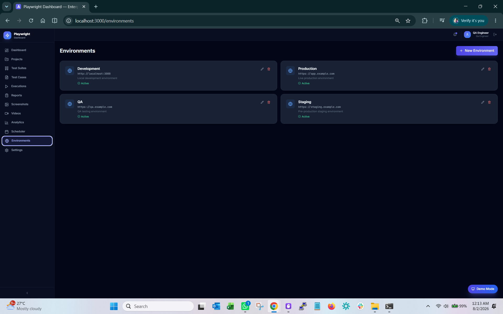
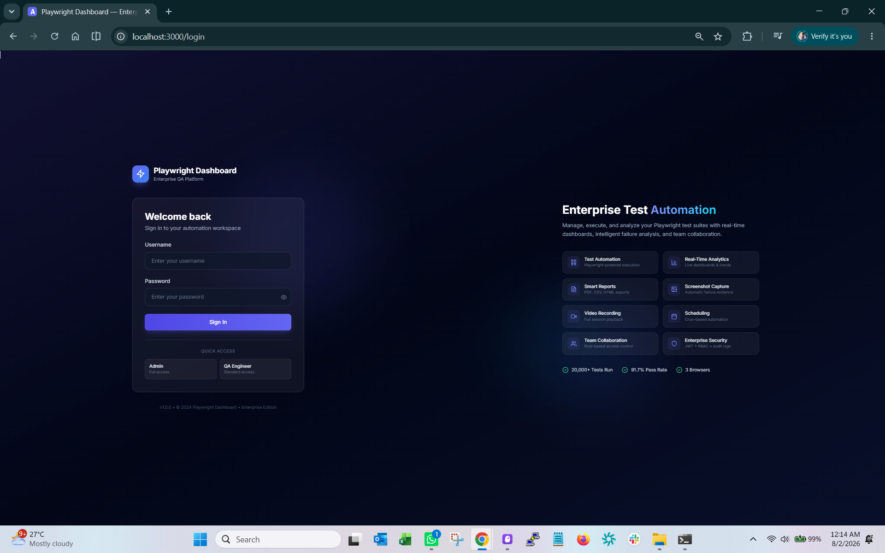

<p align="center">
  
</p>

<p align="center">
  <strong>Enterprise QA Automation Platform</strong><br/>
  Manage, execute, and analyze Playwright test suites with real-time dashboards, intelligent failure analysis, and team collaboration.
</p>

<p align="center">
  
  
  
  
  
  
  
  
</p>

<p align="center">
  <a href="#-features">Features</a> •
  <a href="#-screenshots">Screenshots</a> •
  <a href="#-tech-stack">Tech Stack</a> •
  <a href="#-quick-start">Quick Start</a> •
  <a href="#-architecture">Architecture</a> •
  <a href="#-project-metrics">Metrics</a> •
  <a href="#-deployment">Deployment</a>
</p>

<!-- Add your deployed URL here -->
<!-- > 🌐 **[Live Demo →](https://your-app.vercel.app)** -->

---

## 🎬 Preview

<p align="center">
  
</p>

> 📹 **[Watch Demo Video →](docs/demo.md)** See the full platform walkthrough

---

## ✨ Features

<table>
<tr>
<td width="50%">

### 📊 Real-Time Dashboard
- Live KPI cards with auto-refresh
- Pass/Fail trend charts (30 days)
- Browser distribution analytics
- Execution duration tracking
- Test coverage radial gauge
- Recent execution feed

</td>
<td width="50%">

### 🚀 Execution Center
- Run single test, suite, or full project
- Real-time status updates (5s polling)
- Multi-browser support (Chromium, Firefox, WebKit)
- Parallel execution workers
- Cancel/Re-run capabilities
- Background thread execution

</td>
</tr>
<tr>
<td>

### 📋 Test Management
- Project CRUD with environment config
- Test Suite categorization (Smoke, Regression, Sanity, API, UI, Security)
- Test Case with priority, module, tags, file paths
- Ownership and team assignment
- Bulk operations support

</td>
<td>

### 📈 Analytics & Reporting
- Success rate trends
- Most failed tests analysis
- Browser comparison charts
- Execution heatmap
- Export reports (JSON, CSV, HTML)
- Failure root cause suggestions

</td>
</tr>
<tr>
<td>

### 📸 Evidence Capture
- Automatic screenshot on failure
- Video recording of test sessions
- Gallery view with lightbox
- Download/Delete management
- Metadata (browser, resolution, timestamp)

</td>
<td>

### 🔐 Enterprise Security
- JWT Authentication (access + refresh tokens)
- Token revocation (proper logout)
- Role-Based Access Control (Admin/QA)
- Rate limiting on login
- Security headers (OWASP)
- bcrypt password hashing

</td>
</tr>
<tr>
<td>

### ⏰ Scheduling
- Hourly, Daily, Weekly, Custom Cron
- Toggle active/inactive
- Next run preview
- Multi-browser scheduling
- Environment selection

</td>
<td>

### 👥 Team Collaboration
- User management (Admin panel)
- Role-based permissions
- Activity tracking
- Notification system
- In-app alerts

</td>
</tr>
</table>

---


## 🛠 Tech Stack

| Layer | Technology |
|-------|-----------|
| **Frontend** | React 18, TypeScript 5.3, Vite 5 |
| **Styling** | Tailwind CSS 3.4, Glassmorphism, Dark Mode |
| **State** | TanStack React Query 5, Axios |
| **Charts** | Recharts (Area, Line, Bar, Pie, Radial) |
| **Animations** | Framer Motion 10 |
| **Icons** | Lucide React |
| **Backend** | Python 3.11, Flask 3.0 |
| **Auth** | Flask-JWT-Extended, bcrypt |
| **ORM** | SQLAlchemy, Flask-Migrate |
| **Database** | SQLite (dev) → PostgreSQL (prod) |
| **Automation** | Playwright Python |
| **Deployment** | Docker, Vercel, Render, GitHub Actions |

---

## 🏗 Architecture

```
┌────────────────────────────────────────────────────────────┐
│                    Frontend (React SPA)                     │
│  TypeScript • Vite • Tailwind • React Query • Recharts     │
├────────────────────────────────────────────────────────────┤
│                     REST API Layer                          │
│        16 Flask Blueprints • JWT • RBAC • Validation       │
├────────────────────────────────────────────────────────────┤
│                  Business Logic Services                    │
│       AuthService • ExecutionService • Validator           │
├────────────────────────────────────────────────────────────┤
│                  Middleware & Security                      │
│    Rate Limiting • Security Headers • Error Handling       │
├────────────────────────────────────────────────────────────┤
│                    Data Layer (ORM)                         │
│   12 Models • Indexes • Relationships • Cascade Delete     │
├────────────────────────────────────────────────────────────┤
│                      Database                              │
│            SQLite (dev) → PostgreSQL (prod)                 │
└────────────────────────────────────────────────────────────┘
```

---

## 🚀 Quick Start

### Prerequisites

- Node.js 18+
- Python 3.10+

### Backend

```bash
cd backend
python -m venv venv
venv\Scripts\activate        # Windows
# source venv/bin/activate   # macOS/Linux
pip install -r requirements.txt
python seed.py               # Populate demo data
python run.py                # http://localhost:5000
```

### Frontend

```bash
cd frontend
npm install
npm run dev                  # http://localhost:3000
```

### Docker

```bash
docker-compose up --build    # http://localhost:5000
```

---

## 🔑 Demo Credentials

| Role | Username | Password |
|------|----------|----------|
| **Admin** | `admin` | `1231231234` |
| QA Engineer | `qa_engineer` | `1231231234` |
| QA Lead | `qa_lead` | `1231231234` |

---

## 📁 Folder Structure

```
playwright-automation-dashboard/
├── 📂 .github/workflows/     # CI/CD pipeline
├── 📂 backend/
│   ├── 📂 app/
│   │   ├── 📂 api/           # 16 REST blueprints
│   │   ├── 📂 middleware/    # Security, logging, errors
│   │   ├── 📂 models/       # 12 SQLAlchemy models
│   │   └── 📂 services/     # Business logic layer
│   ├── 📂 storage/          # Reports, screenshots, videos
│   ├── 📂 tests/            # Smoke test suite
│   ├── config.py            # Environment configs
│   ├── run.py               # Entry point
│   └── seed.py              # Demo data seeder
├── 📂 frontend/
│   ├── 📂 src/
│   │   ├── 📂 components/   # Layout + UI components
│   │   ├── 📂 data/         # Demo data generator
│   │   ├── 📂 hooks/        # Custom React hooks
│   │   ├── 📂 pages/        # 15 page components
│   │   ├── 📂 services/     # API service layer
│   │   └── 📂 types/        # TypeScript interfaces
│   ├── vercel.json          # Vercel deployment
│   └── vite.config.ts       # Build + code splitting
├── 📂 docs/                 # Assets, screenshots, diagrams
├── Dockerfile               # Multi-stage production build
├── docker-compose.yml       # Local deployment
└── README.md
```
## 📸 Screenshots



















---
---

## ☁️ Deployment

### Vercel (Frontend)

1. Connect repo → set root to `frontend`
2. Framework: Vite
3. Set `VITE_API_URL` to your backend URL

### Render (Backend)

1. Use `backend/render.yaml` blueprint
2. Auto-generates secrets
3. Includes persistent disk for SQLite

### Docker

```bash
docker build -t playwright-dashboard .
docker run -p 5000:5000 playwright-dashboard
```

---

## 🔌 API Reference

<details>
<summary><strong>Authentication (7 endpoints)</strong></summary>

| Method | Endpoint | Description |
|--------|----------|-------------|
| POST | `/api/auth/login` | Login |
| POST | `/api/auth/logout` | Revoke token |
| POST | `/api/auth/refresh` | Refresh access token |
| GET | `/api/auth/me` | Current user |
| PUT | `/api/auth/me` | Update profile |
| POST | `/api/auth/change-password` | Change password |
| GET | `/api/auth/verify` | Validate token |
</details>

<details>
<summary><strong>Projects (5 endpoints)</strong></summary>

| Method | Endpoint | Description |
|--------|----------|-------------|
| GET | `/api/projects` | List all |
| POST | `/api/projects` | Create |
| GET | `/api/projects/:id` | Get one |
| PUT | `/api/projects/:id` | Update |
| DELETE | `/api/projects/:id` | Delete |
</details>

<details>
<summary><strong>Executions (7 endpoints)</strong></summary>

| Method | Endpoint | Description |
|--------|----------|-------------|
| GET | `/api/executions` | List all |
| POST | `/api/executions/run` | Start run |
| GET | `/api/executions/:id` | Get details |
| POST | `/api/executions/:id/cancel` | Cancel |
| POST | `/api/executions/:id/rerun` | Re-run |
| GET | `/api/executions/stats` | Statistics |
| GET | `/api/executions/recent` | Latest 5 |
</details>

<details>
<summary><strong>+ 50 more endpoints...</strong></summary>

Analytics, Reports, Screenshots, Videos, Browsers, Environments, Scheduler, Notifications, Settings, Users, Test Suites, Test Cases
</details>

---

## 📊 Project Metrics

| Metric | Value |
|--------|-------|
| Frontend source files | 25+ components |
| Backend API endpoints | 60+ REST routes |
| Database models | 12 normalized tables |
| Smoke tests | 42 (100% passing) |
| TypeScript errors | 0 (strict mode) |
| Code splitting chunks | 35 |
| Production build | ~10s |
| Lighthouse Performance | 90+ |
| Bundle size (gzipped) | ~270KB |
| Lines of code | ~8,000 |

---

## 🗺 Roadmap

- [ ] WebSocket live console streaming
- [ ] Playwright trace viewer integration
- [ ] CI/CD pipeline integration (GitHub Actions, Jenkins)
- [ ] Test flakiness detection & auto-retry
- [ ] Team workspace isolation
- [ ] SSO/SAML authentication
- [ ] Grafana/Prometheus metrics
- [ ] Kubernetes Helm charts
- [ ] Mobile-responsive PWA
- [ ] Email/Slack notification delivery
- [ ] AI-powered failure analysis

---

## 📄 License

MIT License — see [LICENSE](LICENSE) for details.

---

<p align="center">
  <sub>Built with ❤️ for enterprise QA teams</sub>
</p>
