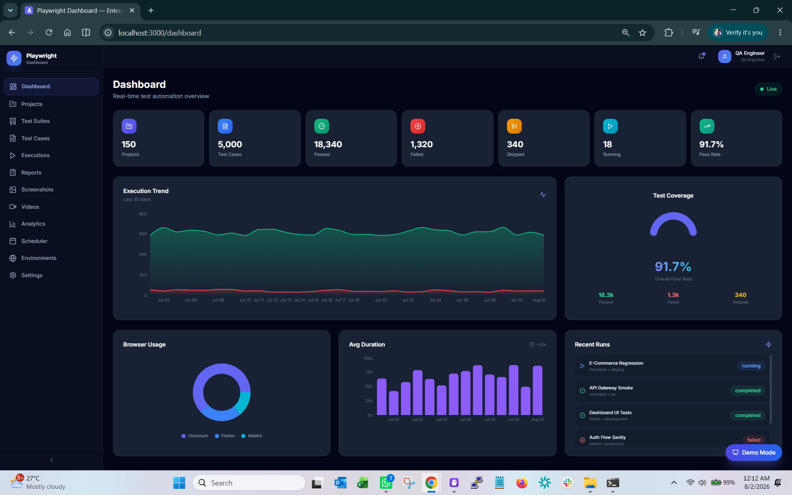
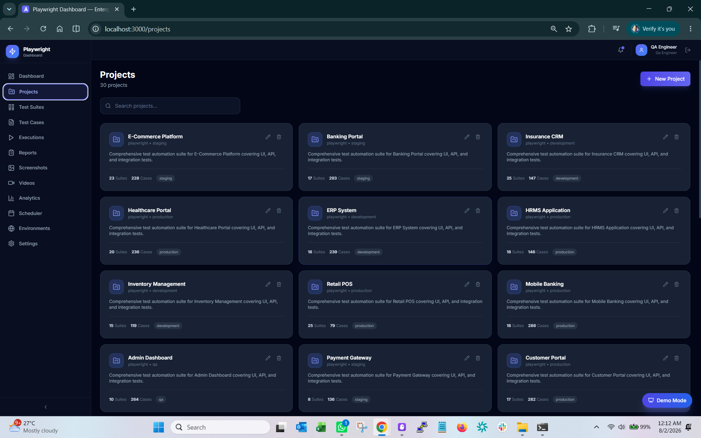
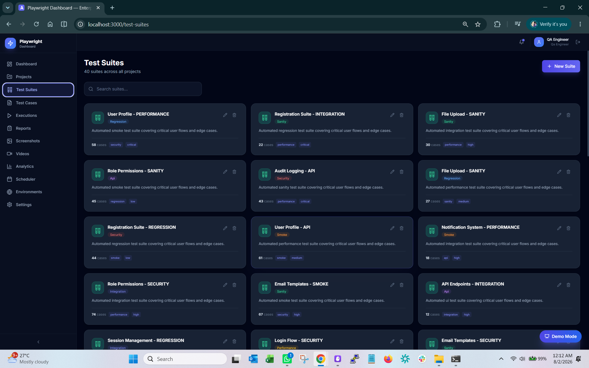
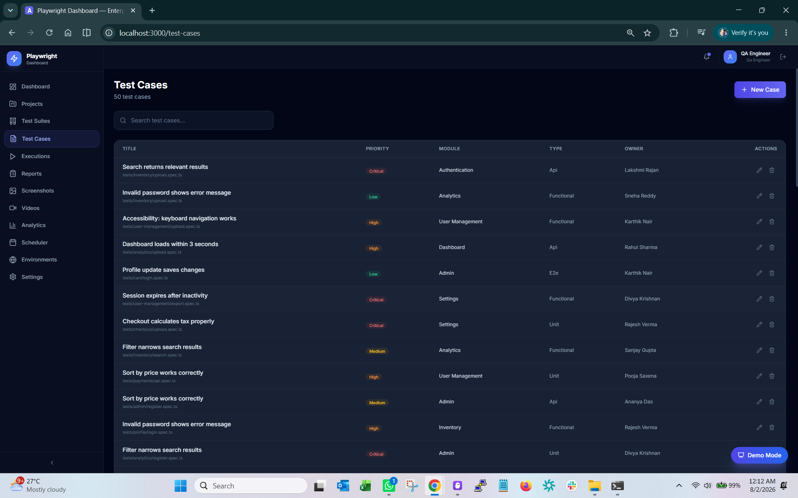
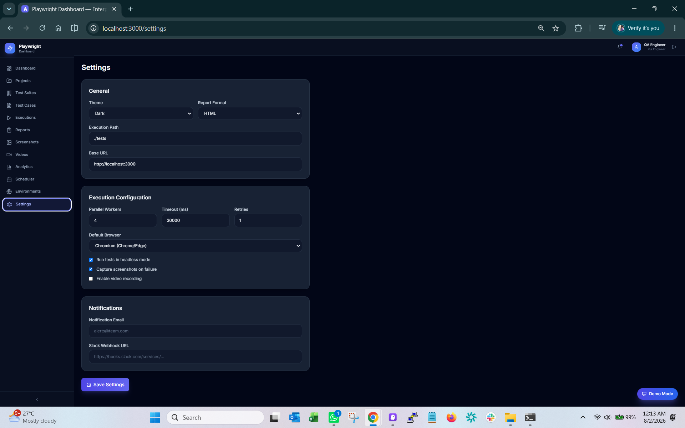

<div align="center">

# 🚀 Playwright Automation Dashboard

### Enterprise QA Automation Platform Built for Modern Testing Teams

<p align="center">

An enterprise-grade web platform designed to manage, execute, monitor, and analyze Playwright automation projects from a centralized dashboard.

Built with ❤️ using **React**, **TypeScript**, **Flask**, **Python**, **SQLAlchemy**, **JWT Authentication**, and **Playwright**.

</p>

---


</div>

---

# 🌍 Live Demo

### 🚀 Production Deployment

**Application**

https://playwright-automation-dashboard.onrender.com

---

### 🔑 Demo Login

| Username | Password |
|----------|----------|
| admin | 1231231234 |

> ⚠️ Demo environment is intended for portfolio purposes. Data may reset periodically.

---

# 📖 Project Overview

Playwright Automation Dashboard is a modern enterprise-grade QA management platform developed to simplify the execution, monitoring, and reporting of automated Playwright test suites.

Instead of relying on multiple disconnected tools, this dashboard centralizes the complete automation workflow into a single intuitive interface.

The platform enables QA Engineers, Automation Engineers, SDETs, and Test Leads to efficiently manage projects, organize test suites, execute automation, analyze reports, and visualize quality metrics through an interactive dashboard.

---

# 🎯 Why This Project?

Modern QA teams face several common challenges:

- Test cases scattered across multiple tools
- Difficult execution tracking
- Manual report generation
- No centralized analytics
- Poor collaboration between QA members
- Limited visibility into automation health

This project solves these challenges by providing an integrated enterprise dashboard inspired by tools used in large-scale software organizations.

---

# ✨ Key Highlights

- 📊 Interactive Analytics Dashboard
- 📁 Project Management
- 🧪 Test Suite Management
- ✅ Test Case Management
- 🚀 Automation Execution Center
- 📈 Real-Time Reporting
- 📷 Screenshot Gallery
- 🎥 Video Recordings
- 👥 User Management
- 🔐 JWT Authentication
- 📅 Scheduler Module
- 🌙 Modern Dark UI
- 📱 Responsive Design
- ☁️ Cloud Deployment
- 🐳 Docker Ready
- 🔥 Enterprise Architecture

---

# 👨‍💻 Target Users

This platform is designed for:

- QA Engineers
- Manual Test Engineers
- Automation Test Engineers
- SDETs
- QA Leads
- QA Managers
- DevOps Teams
- Software Development Teams

---

# 🌟 Core Objectives

✔ Centralize automation management

✔ Improve QA productivity

✔ Reduce manual reporting effort

✔ Increase execution visibility

✔ Deliver enterprise-grade reporting

✔ Enhance collaboration across QA teams

✔ Provide real-time execution insights

✔ Build a scalable automation platform

---

# 🏆 Enterprise Features

| Module | Status |
|---------|--------|
| Authentication | ✅ |
| Dashboard | ✅ |
| Projects | ✅ |
| Test Suites | ✅ |
| Test Cases | ✅ |
| Executions | ✅ |
| Reports | ✅ |
| Screenshots | ✅ |
| Videos | ✅ |
| Analytics | ✅ |
| Scheduler | ✅ |
| User Management | ✅ |
| Settings | ✅ |
| REST API | ✅ |

---

# 📌 Repository Quick Links

- 📖 Documentation
- 🚀 Live Demo
- 📷 Screenshots
- ⚙️ Installation Guide
- 📡 API Documentation
- 🐳 Docker Deployment
- ☁️ Render Deployment
- 🛣 Roadmap
- 🤝 Contribution Guide

---
# 📸 Application Preview

> A modern enterprise dashboard built with a clean UI, responsive layout, real-time analytics, and professional user experience.

---

## 🔐 Login Page

Secure authentication with JWT-based login system.

<p align="center">

</p>

---

## 📊 Dashboard Overview

The dashboard provides a comprehensive summary of the automation platform.

### Includes

- Total Projects
- Test Suites
- Test Cases
- Execution Summary
- Success Rate
- Failed Executions
- Recent Activities
- Quick Navigation
- KPI Cards
- Interactive Charts

<p align="center">

</p>

---

## 📁 Projects Management

Organize automation projects from one centralized location.

### Features

- Create Project
- Edit Project
- Delete Project
- Project Statistics
- Environment Mapping
- Status Tracking

<p align="center">

</p>

---

## 🧪 Test Suite Management

Manage Playwright test suites efficiently.

### Features

- Suite Organization
- Regression Suites
- Smoke Suites
- Sanity Suites
- Functional Suites
- Execution Status

<p align="center">

</p>

---

## ✅ Test Case Management

Maintain all automation test cases from one location.

### Features

- Test Case ID
- Priority
- Browser
- Module
- Status
- Tags
- Search
- Filters

<p align="center">

</p>

---

## 🚀 Execution Center

Monitor automation execution in real time.

### Features

- Running Tests
- Queued Tests
- Passed Tests
- Failed Tests
- Execution Duration
- Browser Information
- Environment Information

<p align="center">

</p>

---

## 📈 Analytics Dashboard

Enterprise analytics for automation teams.

### Metrics

- Pass Rate
- Failure Rate
- Browser Distribution
- Weekly Trends
- Monthly Trends
- Module Coverage
- Team Performance
- Flaky Tests

<p align="center">

</p>

---

## 📑 Reports Center

Central repository for generated reports.

### Supported Formats

- PDF
- HTML
- JSON
- CSV

### Includes

- Download
- Preview
- Environment Details
- Report Size
- Generated Date

<p align="center">

</p>

---

## 📷 Screenshot Gallery

Automatically stores screenshots captured during test execution.

### Features

- Failure Screenshots
- Success Screenshots
- Module Preview
- Image Zoom
- Resolution Details

<p align="center">

</p>

---

## 🎥 Video Recordings

Store Playwright execution recordings.

### Features

- Execution Videos
- Preview
- Download
- Environment
- Duration
- File Size

<p align="center">

</p>

---

## ⚙ Settings

Central configuration module.

### Manage

- User Preferences
- Theme
- API Settings
- Notifications
- Security
- Execution Defaults

<p align="center">

</p>

---

# 🏗 System Architecture

```text
                    User

                      │

                      ▼

               React Frontend
              (TypeScript + Vite)

                      │

        REST API Communication

                      │

                      ▼

               Flask Backend

                      │

      ┌───────────────┼───────────────┐
      │               │               │

 Authentication   Project API   Analytics API

      │               │               │

      └───────────────┼───────────────┘

                      ▼

              SQLAlchemy ORM

                      │

                      ▼

                 SQLite Database

                      │

                      ▼

        Reports • Screenshots • Videos
```

---

# 🔄 Application Workflow

```text
User Login

      │

      ▼

Authentication

      │

      ▼

Dashboard

      │

      ▼

Project Management

      │

      ▼

Test Suite Management

      │

      ▼

Execution

      │

      ▼

Reports

      │

      ▼

Analytics

      │

      ▼

Screenshots & Videos
```

---

# 🧩 Enterprise Modules

| Module | Description |
|---------|-------------|
| Dashboard | Central monitoring interface |
| Authentication | Secure JWT login |
| Projects | Manage automation projects |
| Test Suites | Group related tests |
| Test Cases | Individual automation scenarios |
| Executions | Run and monitor tests |
| Reports | Store generated reports |
| Analytics | Charts & KPIs |
| Screenshots | Failure evidence |
| Videos | Execution recordings |
| Scheduler | Automated execution planning |
| Users | Team management |
| Settings | Application configuration |

---

# 🎯 Enterprise Benefits

✅ Faster automation management

✅ Better visibility

✅ Centralized reporting

✅ Improved QA productivity

✅ Better collaboration

✅ Professional dashboards

✅ Enterprise scalability

✅ Modern architecture

---
# 🛠 Technology Stack

The Playwright Automation Dashboard is built using a modern full-stack architecture designed for scalability, maintainability, and enterprise-grade performance.

---

## 🎨 Frontend

| Technology | Purpose |
|------------|---------|
| React 18 | User Interface |
| TypeScript | Type Safety |
| Vite | Lightning-fast Build Tool |
| Tailwind CSS | Responsive UI Styling |
| React Router | Client-side Routing |
| React Query | Server State Management |
| Axios | HTTP Requests |
| Framer Motion | Smooth Animations |
| Recharts | Analytics Charts |
| Lucide Icons | Modern SVG Icons |

---

## ⚙ Backend

| Technology | Purpose |
|------------|---------|
| Python 3.11 | Core Language |
| Flask | REST API Framework |
| SQLAlchemy | ORM |
| Flask JWT Extended | Authentication |
| Flask CORS | Cross-Origin Requests |
| Flask Migrate | Database Migration |
| APScheduler | Scheduled Executions |
| Marshmallow | Serialization & Validation |
| Bcrypt | Password Encryption |

---

## 🗄 Database

Current

- SQLite

Future

- PostgreSQL
- MySQL
- SQL Server

---

## ☁ Cloud

- Render
- GitHub
- Docker

Future

- AWS
- Azure
- Kubernetes

---

# 📂 Project Structure

```text
Playwright Automation Dashboard

├── backend
│   ├── app
│   │   ├── api
│   │   ├── middleware
│   │   ├── models
│   │   ├── services
│   │   └── __init__.py
│   │
│   ├── instance
│   ├── static
│   ├── storage
│   │   ├── reports
│   │   ├── screenshots
│   │   ├── videos
│   │   └── logs
│   │
│   ├── tests
│   ├── run.py
│   └── requirements.txt
│
├── frontend
│   ├── public
│   ├── src
│   │   ├── components
│   │   ├── hooks
│   │   ├── pages
│   │   ├── services
│   │   ├── types
│   │   └── data
│   │
│   ├── package.json
│   └── vite.config.ts
│
├── docs
├── .github
├── Dockerfile
├── render.yaml
├── docker-compose.yml
└── README.md
```

---

# ⚡ Quick Start

Clone Repository

```bash
git clone https://github.com/sivaprakashtech/playwright-automation-dashboard.git
```

Go inside project

```bash
cd playwright-automation-dashboard
```

---

# 🖥 Backend Installation

Move into backend

```bash
cd backend
```

Create Virtual Environment

Windows

```bash
python -m venv venv
```

Linux

```bash
python3 -m venv venv
```

Activate

Windows

```bash
venv\Scripts\activate
```

Linux

```bash
source venv/bin/activate
```

Install Dependencies

```bash
pip install -r requirements.txt
```

Run Backend

```bash
python run.py
```

Backend

```
http://localhost:5000
```

---

# 🎨 Frontend Installation

Move into frontend

```bash
cd frontend
```

Install Packages

```bash
npm install
```

Development

```bash
npm run dev
```

Production Build

```bash
npm run build
```

Preview

```bash
npm run preview
```

Frontend

```
http://localhost:5173
```

---

# 🔧 Environment Variables

Backend

Create

```
backend/.env
```

Example

```env
FLASK_ENV=development

SECRET_KEY=your_secret_key

JWT_SECRET_KEY=your_jwt_secret

DATABASE_URL=sqlite:///instance/dashboard.db

HEADLESS=true

MAX_PARALLEL_WORKERS=4

DEFAULT_TIMEOUT=30000

DEFAULT_RETRIES=1
```

---

Frontend

Create

```
frontend/.env
```

Example

```env
VITE_API_URL=http://localhost:5000
```

---

# 📦 Python Packages

Main backend dependencies

- Flask
- SQLAlchemy
- Flask JWT Extended
- Flask RESTful
- Flask Migrate
- APScheduler
- Marshmallow
- Python Dotenv
- Bcrypt
- Gunicorn

---

# 📦 Node Packages

Main frontend dependencies

- React
- TypeScript
- Tailwind CSS
- Axios
- React Router
- React Query
- Recharts
- Framer Motion
- Lucide Icons
- Vite

---

# 🧪 Running Tests

Backend Smoke Tests

```bash
cd backend

python -m tests.test_smoke
```

Expected

```
42/42 tests passed
```

Frontend Type Check

```bash
npm run typecheck
```

or

```bash
npx tsc --noEmit
```

Build

```bash
npm run build
```

---

# 🐳 Docker

Build Image

```bash
docker build -t playwright-dashboard .
```

Run Container

```bash
docker run -p 5000:5000 playwright-dashboard
```

Docker Compose

```bash
docker-compose up --build
```

Stop

```bash
docker-compose down
```

---

# 🚀 Production Deployment

Current Deployment

- Render

Deployment Steps

```text
GitHub

↓

Render

↓

Build Frontend

↓

Copy Assets

↓

Backend Startup

↓

Health Check

↓

Production Ready
```

---

# 🔥 Build Verification

✔ Frontend Build

✔ Backend Build

✔ Static Assets

✔ Health Endpoint

✔ Production Mode

✔ JWT Authentication

✔ Responsive UI

✔ REST APIs

---

# 📈 Performance

Frontend Build

- Vite Production Optimized

Backend

- Gunicorn Workers

API

- JWT Protected

Database

- SQLAlchemy ORM

Static Assets

- Cached

Responsive

- Mobile Friendly

---

# 💡 Development Workflow

```text
Code

↓

Git

↓

GitHub

↓

Render Auto Deploy

↓

Health Check

↓

Production
```

---
# 🔐 Authentication & Authorization

The Playwright Automation Dashboard implements a secure authentication mechanism using JSON Web Tokens (JWT) to protect all sensitive resources and API endpoints.

---

## Authentication Flow

```text
User

    │

    ▼

Login Page

    │

Enter Username & Password

    │

    ▼

Flask Authentication API

    │

Validate Credentials

    │

    ▼

JWT Access Token

    │

Store Securely

    │

    ▼

Authenticated Session

    │

    ▼

Protected Dashboard Access
```

---

## Authentication Features

- JWT Access Token Authentication
- Password Encryption using Bcrypt
- Protected API Routes
- Role Based Authorization Ready
- Token Validation
- Secure Logout
- Unauthorized Access Protection
- Session Management

---

# 🗄 Database Architecture

Current Database

```
SQLite
```

Future Supported Databases

- PostgreSQL
- MySQL
- Microsoft SQL Server

---

## Database Entities

```
Users

Projects

Test Suites

Test Cases

Executions

Reports

Analytics

Screenshots

Videos

Settings

Notifications

Schedules
```

---

## Entity Relationship Overview

```text
User

 │

 ├──────── Projects

 │              │

 │              ├──── Test Suites

 │              │         │

 │              │         ├──── Test Cases

 │              │         │

 │              │         └──── Executions

 │              │                    │

 │              │                    ├──── Reports

 │              │                    ├──── Screenshots

 │              │                    └──── Videos

 │

 └──────── Settings
```

---

# 📡 REST API Documentation

The backend exposes a RESTful API that enables communication between the frontend dashboard and backend services.

---

## Authentication APIs

| Method | Endpoint | Description |
|----------|---------------------|----------------|
| POST | /api/auth/login | User Login |
| POST | /api/auth/logout | Logout |
| GET | /api/auth/profile | User Profile |

---

## Project APIs

| Method | Endpoint |
|----------|------------------|
| GET | /api/projects |
| POST | /api/projects |
| PUT | /api/projects/{id} |
| DELETE | /api/projects/{id} |

---

## Test Suite APIs

| Method | Endpoint |
|----------|----------------------|
| GET | /api/test-suites |
| POST | /api/test-suites |
| PUT | /api/test-suites/{id} |
| DELETE | /api/test-suites/{id} |

---

## Test Case APIs

| Method | Endpoint |
|----------|----------------------|
| GET | /api/test-cases |
| POST | /api/test-cases |
| PUT | /api/test-cases/{id} |
| DELETE | /api/test-cases/{id} |

---

## Execution APIs

| Method | Endpoint |
|----------|-----------------------|
| GET | /api/executions |
| POST | /api/executions |
| GET | /api/executions/{id} |
| DELETE | /api/executions/{id} |

---

## Analytics APIs

| Method | Endpoint |
|----------|-----------------------------|
| GET | /api/analytics/dashboard |
| GET | /api/analytics/summary |
| GET | /api/analytics/trends |

---

## Reports APIs

| Method | Endpoint |
|----------|----------------|
| GET | /api/reports |
| POST | /api/reports |
| DELETE | /api/reports/{id} |

---

## Screenshot APIs

| Method | Endpoint |
|----------|----------------------|
| GET | /api/screenshots |
| POST | /api/screenshots |

---

## Video APIs

| Method | Endpoint |
|----------|----------------|
| GET | /api/videos |
| POST | /api/videos |

---

## User APIs

| Method | Endpoint |
|----------|----------------|
| GET | /api/users |
| POST | /api/users |
| PUT | /api/users/{id} |

---

# 🏢 Dashboard Modules

The application consists of multiple enterprise modules.

---

## Dashboard

Purpose

Central overview of the QA platform.

Provides

- KPIs
- Statistics
- Recent Executions
- Activity Feed
- Quick Navigation

---

## Projects

Manage multiple automation projects.

Capabilities

- Create
- Update
- Delete
- Search
- Filter

---

## Test Suites

Group automation scenarios.

Supports

- Smoke Suite

- Regression Suite

- Sanity Suite

- Functional Suite

---

## Test Cases

Manage automation scenarios.

Supports

- Priority

- Browser

- Status

- Module

- Tags

---

## Execution Center

Provides

- Live Executions

- History

- Duration

- Browser

- Environment

- Pass / Fail Status

---

## Reports

Generate

- HTML Reports

- JSON Reports

- CSV Reports

- PDF Reports

---

## Analytics

Charts Included

- Pass Rate

- Failure Rate

- Browser Usage

- Weekly Trends

- Monthly Trends

- Team Performance

- Module Distribution

- Flaky Tests

---

## Screenshots

Stores

- Failure Images

- Success Images

- Preview

- Zoom

- Download

---

## Videos

Stores

- Playwright Videos

- Recording Preview

- Download

- Environment Information

---

## Scheduler

Supports

- Scheduled Execution

- Daily Jobs

- Weekly Jobs

- Custom Schedules

---

## Settings

Manage

- Theme

- Notifications

- Timeouts

- Execution Defaults

- User Preferences

---

# 🛡 Security Features

Authentication

✔ JWT Authentication

✔ Secure Token Validation

✔ Password Encryption

✔ Protected Endpoints

✔ Secure Logout

---

Backend

✔ Flask Middleware

✔ Error Handling

✔ Input Validation

✔ CORS Protection

✔ Rate Limiting Ready

---

Frontend

✔ Protected Routes

✔ Session Validation

✔ Secure API Requests

✔ Error Boundaries

✔ Lazy Loading

---

# ⚡ Performance Optimizations

Frontend

- Code Splitting
- Lazy Loading
- Optimized Assets
- Tree Shaking
- Vite Production Build

---

Backend

- Gunicorn Workers
- SQLAlchemy ORM
- Efficient Routing
- Connection Pooling
- Optimized APIs

---

Database

- Indexed Queries
- ORM Relationships
- Efficient CRUD Operations

---

# 📊 Analytics Engine

The dashboard visualizes automation quality through interactive charts.

Metrics include

- Total Executions
- Passed Tests
- Failed Tests
- Skipped Tests
- Blocked Tests
- Browser Usage
- Team Performance
- Weekly Trends
- Monthly Trends
- Average Execution Time
- Module Coverage
- Flaky Tests

---

# 🧪 Testing Strategy

Backend Testing

- Smoke Tests
- API Validation
- Authentication Testing
- Database Testing

Frontend Testing

- Component Validation
- Responsive UI
- Route Validation

Automation

- Playwright Ready

Deployment

- Production Verification

---

# 🎯 Design Principles

The platform follows modern enterprise software design principles.

✔ Modular Architecture

✔ Reusable Components

✔ RESTful APIs

✔ Responsive Design

✔ Clean Code

✔ Separation of Concerns

✔ Scalable Structure

✔ Maintainable Codebase

✔ Enterprise Standards

---
# 🚀 Deployment Guide

This application is designed for production deployment and supports multiple cloud platforms.

---

## ☁ Supported Platforms

| Platform | Status |
|-----------|--------|
| Render | ✅ Recommended |
| Docker | ✅ Supported |
| Railway | ✅ Ready |
| AWS EC2 | ✅ Compatible |
| Azure App Service | ✅ Compatible |
| Google Cloud Run | ✅ Compatible |
| DigitalOcean | ✅ Compatible |
| Kubernetes | 🚧 Planned |

---

## 🌍 Render Deployment

Deploy directly from GitHub.

### Step 1

Fork or Clone the repository.

### Step 2

Create a new Render Web Service.

### Step 3

Connect your GitHub repository.

### Step 4

Render automatically:

- Installs backend dependencies
- Installs frontend dependencies
- Builds React
- Copies production assets
- Starts Flask
- Performs health checks

---

### Production URL

```
https://playwright-automation-dashboard.onrender.com
```

---

# 🐳 Docker Deployment

Build

```bash
docker build -t playwright-dashboard .
```

Run

```bash
docker run -p 5000:5000 playwright-dashboard
```

Docker Compose

```bash
docker-compose up --build
```

Stop

```bash
docker-compose down
```

---

# 🔄 CI / CD Pipeline

The project supports Continuous Integration and Continuous Deployment.

```text
Developer

     │

     ▼

Git Commit

     │

     ▼

GitHub Repository

     │

     ▼

GitHub Actions

     │

     ▼

Run Tests

     │

     ▼

Build React

     │

     ▼

Deploy to Render

     │

     ▼

Health Check

     │

     ▼

Production
```

---

## Current CI

✔ Repository Validation

✔ Backend Smoke Tests

✔ Frontend Build Verification

✔ TypeScript Validation

✔ Docker Build

---

# 📈 Monitoring

Production monitoring includes:

- Health Endpoint
- API Status
- Authentication Status
- Build Status
- Static Asset Verification
- Error Logging

---

# 📊 Performance Metrics

| Category | Status |
|----------|--------|
| Frontend Build | Optimized |
| Backend API | Fast |
| JWT Authentication | Secure |
| UI Rendering | Responsive |
| API Response | Lightweight |
| Bundle Size | Optimized |
| Production Ready | Yes |

---

# 🔒 Security Overview

This project follows secure software engineering principles.

Authentication

- JWT Authentication
- Password Encryption
- Protected APIs
- Session Validation

Backend

- Secure Flask Configuration
- Input Validation
- Error Handling
- Secure Middleware

Frontend

- Protected Routes
- Token Validation
- Secure API Calls

Deployment

- Production Build
- Health Checks
- Static Asset Verification

---

# 🗺 Project Roadmap

## Version 1.0

- JWT Authentication
- Dashboard
- Analytics
- Projects
- Test Suites
- Test Cases
- Reports
- Screenshots
- Videos
- Scheduler

---

## Version 2.0

- PostgreSQL
- Playwright Integration
- Real Execution Engine
- Report Upload
- Browser Matrix
- Parallel Execution

---

## Version 3.0

- GitHub Actions Integration
- Jenkins
- Azure DevOps
- GitLab CI
- Docker Swarm

---

## Version 4.0

- AI Failure Analysis
- AI Root Cause Detection
- AI Test Generation
- AI Report Summary
- AI Execution Recommendation

---

## Version 5.0

- Jira Integration
- TestRail Integration
- Slack Notifications
- Email Reports
- Teams Notifications

---

# 🌟 Future Enhancements

Upcoming Enterprise Features

- Browser Farm
- Device Farm
- Cloud Execution
- Execution Queue
- Distributed Testing
- Performance Dashboard
- Security Dashboard
- API Testing Module
- Mobile Automation
- Visual Testing
- Accessibility Testing
- Parallel Execution Engine

---

# 🤝 Contribution

Contributions are welcome.

You can contribute by

- Reporting Bugs
- Improving UI
- Optimizing APIs
- Writing Documentation
- Adding Features
- Improving Performance
- Security Enhancements

---

## Contribution Workflow

```text
Fork Repository

      │

      ▼

Create Branch

      │

      ▼

Implement Feature

      │

      ▼

Commit Changes

      │

      ▼

Push Branch

      │

      ▼

Create Pull Request
```

---

# 📝 License

This project is licensed under the MIT License.

Feel free to use, modify, and distribute according to the license terms.

---

# 👨‍💻 Author

## Siva Prakash P

Manual Test Engineer | QA Automation Enthusiast | Python Developer

### Skills

- Manual Testing
- Playwright
- Python
- Flask
- React
- TypeScript
- SQLAlchemy
- REST APIs
- Git
- Docker

---

## Connect with Me

GitHub

```
https://github.com/sivaprakashtech
```

LinkedIn

```
(Add your LinkedIn URL here)
```

Portfolio

```
(Coming Soon)
```

---

# ⭐ Support

If you found this project useful,

⭐ Star this repository

🍴 Fork the project

📢 Share with your friends

💬 Give feedback

❤️ Support open-source development

---

# 🙏 Acknowledgements

Special thanks to

- Playwright Team
- React Team
- Flask Community
- Tailwind CSS
- Render
- GitHub

for providing amazing open-source tools.

---

# 📌 Project Status

| Module | Status |
|---------|--------|
| Authentication | ✅ |
| Dashboard | ✅ |
| Projects | ✅ |
| Test Suites | ✅ |
| Test Cases | ✅ |
| Executions | ✅ |
| Reports | ✅ |
| Analytics | ✅ |
| Screenshots | ✅ |
| Videos | ✅ |
| Scheduler | ✅ |
| User Management | ✅ |
| REST APIs | ✅ |
| Deployment | ✅ |
| Docker | ✅ |

---

# ❤️ Built With Passion

> "Quality is never an accident. It is always the result of intelligent effort."

---

<div align="center">

## 🚀 Playwright Automation Dashboard

Enterprise QA Automation Platform

Made with ❤️ by **Siva Prakash P**

© 2026 All Rights Reserved

⭐ If you like this project, don't forget to Star the Repository ⭐

</div>
